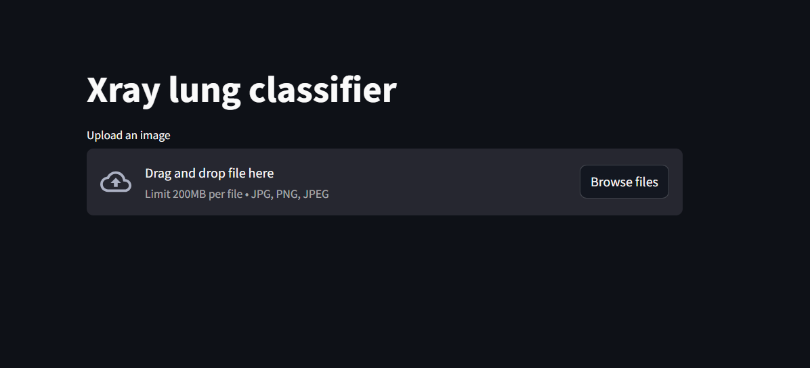
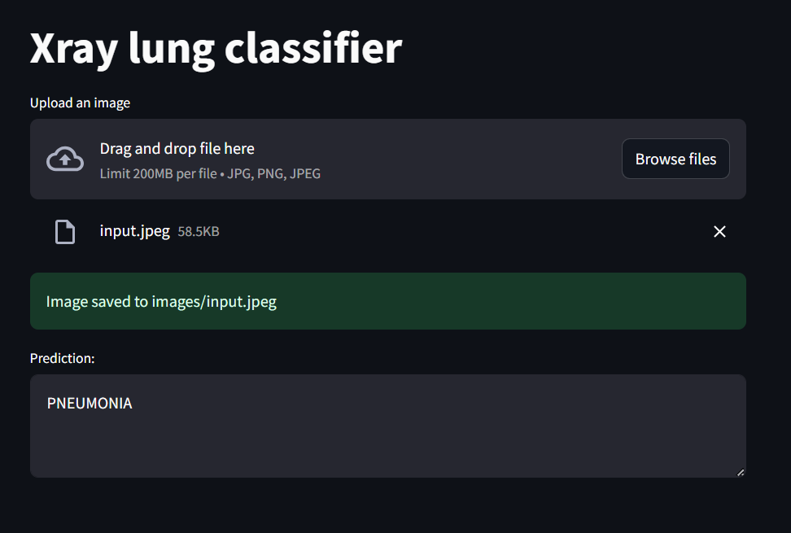

# Lung X-ray Classification

This project aims to classify lung X-ray images using machine learning. The application is designed to help in the detection of Pneumonia by analyzing X-ray images.

---

# Web App Link

link: http://54.152.21.235:8501/

## Overview

This project uses machine learning models to classify lung X-ray images. It leverages various workflows, components, and pipelines to preprocess data, train models, and make predictions. The project can be deployed on AWS using BentoML for scalable and reliable inference.

---

## Workflows

- **constants**: Contains constant values used throughout the project.
- **config_entity**: Defines configuration entities required for the project.
- **artifact_entity**: Manages artifact entities, including models and preprocessing objects.
- **components**: Contains the core components for data processing and model training.
- **pipeline**: Manages the workflow pipelines for training and inference.
- **main**: The main entry point for running the application.

---

## Getting Started

Follow below instructions to set up and run the project on your local machine.

1. Clone the repository:
   ```bash
   git clone https://github.com/Saurabh932/Lungs_XRay_Classification.git
   ```
   ```
   cd airfare-prediction
    ```


```bash
conda create -n lungs python=3.8 -y
```

```bash
conda activate lungs
```

```bash
pip install -r requirements.txt
```

```bash
python main.py
```

---

## Technologies Used
- Python
- Flask
- HTML/CSS
- Bootstrap
- Machine Learning (Scikit-learn, Pandas)
- Docker
- AWS (EC2, S# Bucket)
- BentoML

---


## Web Application Demo

**1. Enter the values.**




**2. Click on submit to get final Result**


